# AI Chatbot Architecture for Wellness & E-commerce

## Table of Contents

-   [Executive Summary](#executive-summary)
-   [Core Architecture Overview](#core-architecture-overview)
-   [1. Conversation Architecture](#1-conversation-architecture)
-   [2. Memory Management Architecture](#2-memory-management-architecture)
-   [3. Three-Stage Processing Pipeline](#3-three-stage-processing-pipeline)
-   [4. Guardrails System](#4-guardrails-system)
-   [5. RAG Implementation with Wellness Knowledge](#5-rag-implementation-with-wellness-knowledge)
-   [6. Streaming Response Architecture](#6-streaming-response-architecture)
-   [7. Multi-Modal Capabilities](#7-multi-modal-capabilities)
-   [8. Conversation Examples](#8-conversation-examples)
-   [9. Client-Side Processing & Rendering](#9-client-side-processing--rendering)
-   [Technology Stack Summary](#technology-stack-summary)

## Executive Summary

This document outlines the architecture for an advanced AI chatbot system designed for wellness and e-commerce applications. The system handles complex customer interactions including product recommendations, wellness advice, and personalized guidance through sophisticated memory management, context retrieval, and real-time streaming.

### System Capabilities

**Core Functionality:**

-   **Intelligent Product Recommendations**: Context-aware suggestions based on customer needs, preferences, and wellness goals
-   **Personalized Wellness Guidance**: Evidence-based advice tailored to individual customer journeys and health objectives
-   **Multi-Modal Interactions**: Support for text, voice, and image inputs with consistent experience across platforms
-   **Real-Time Streaming**: Progressive response delivery with interactive UI components for enhanced engagement

**Advanced Features:**

-   **Sophisticated Memory Management**: Dual-layer memory system with progressive summarization for conversations and semantic search for long-term customer history
-   **Comprehensive Safety**: Parallel guardrail system combining OpenAI moderation with custom wellness-specific safety checks
-   **RAG-Enhanced Context**: Retrieval-augmented generation using pgvector for accessing product knowledge, customer history, and wellness information
-   **Cross-Platform Support**: Consistent architecture supporting web applications, mobile apps, and contact centre systems

### Business Benefits

**Customer Experience:**

-   **Immediate Responsiveness**: Sub-second response initiation with progressive content delivery
-   **Contextual Relevance**: Deep understanding of customer preferences and wellness journey
-   **Interactive Engagement**: Dynamic product recommendations, follow-up questions, and personalized actions
-   **Safety Assurance**: Comprehensive content moderation and health-specific guardrails

**Operational Advantages:**

-   **Scalable Architecture**: Multi-stage processing pipeline optimized for high concurrent users
-   **Cost Efficiency**: Token-optimized prompts and intelligent context management reduce AI costs
-   **Platform Flexibility**: Single architecture supporting multiple client types and deployment scenarios
-   **Compliance Ready**: Built-in disclaimer management and content moderation for regulatory requirements

### Technical Innovation

**AI Pipeline Architecture:**
The system employs a sophisticated 7-stage processing pipeline: Guardrails → Preprocessing → Memory Retrieval (Short & Long-term) → RAG Context → Main Processing → Postprocessing → Client Rendering. Each stage is optimized for specific tasks using appropriate model sizes (GPT-4.1 for complex reasoning, GPT-4.1 mini for lightweight processing).

**Memory Innovation:**
Implements a hybrid memory approach combining progressive conversation summarization with semantic vector search, enabling both immediate context awareness and long-term relationship building while maintaining optimal performance.

**Safety & Compliance:**
Features a dual guardrail system running OpenAI moderation and custom wellness safety checks in parallel, ensuring comprehensive content safety without impacting response latency.

This architecture provides a robust foundation for sophisticated wellness chatbots that can handle complex customer needs while maintaining safety, personalization, and regulatory compliance through intelligent memory management and multi-stage processing.

## Core Architecture Overview

[↑ Back to Top](#table-of-contents)

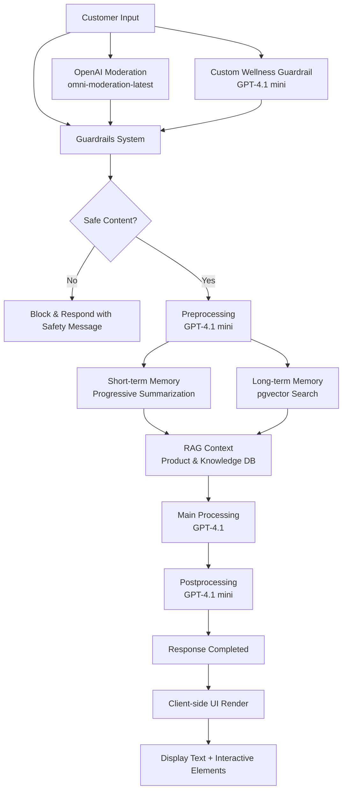

## 1. Conversation Architecture

[↑ Back to Top](#table-of-contents)

### Simplified Hierarchy

The system uses a streamlined three-level approach:

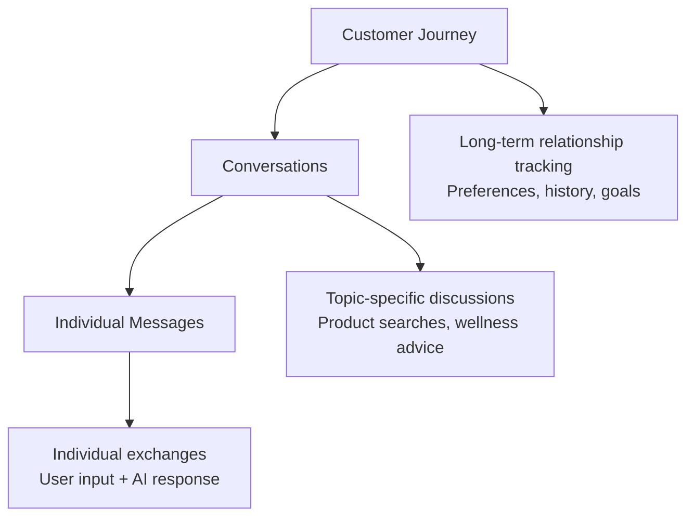

**Example Conversation Flow:**

```
Customer Journey: "Sarah's Wellness Journey"
├── Conversation 1: "Initial vitamin consultation"
│   ├── Message 1: "I'm feeling tired lately, what vitamins might help?"
│   ├── Message 2: "How much sleep are you getting? Any dietary restrictions?"
│   └── Message 3: "Based on your needs, I recommend B-complex vitamins..."
├── Conversation 2: "Follow-up after 2 weeks"
│   ├── Message 1: "The B vitamins are helping! Any immunity boosters?"
│   └── Message 2: "Great to hear! For immunity, consider these options..."
```

## 2. Memory Management Architecture

[↑ Back to Top](#table-of-contents)

### Short-Term Memory: Progressive Summarization

Short-term memory maintains conversation context while managing critical constraints:

**Why Short-Term Memory Management is Essential:**

-   **Token Size Management**: Large language models have token limits that require careful conversation length control
-   **Prompt Effectiveness**: Larger context windows significantly reduce prompt effectiveness and response quality
-   **Cost Optimization**: Shorter, more focused context reduces API costs and improves response latency

**Recursive Summarization Strategy:**
When conversation summaries themselves exceed token thresholds, the system recursively summarizes the summaries, creating a hierarchical compression system that maintains essential context while staying within optimal token ranges.

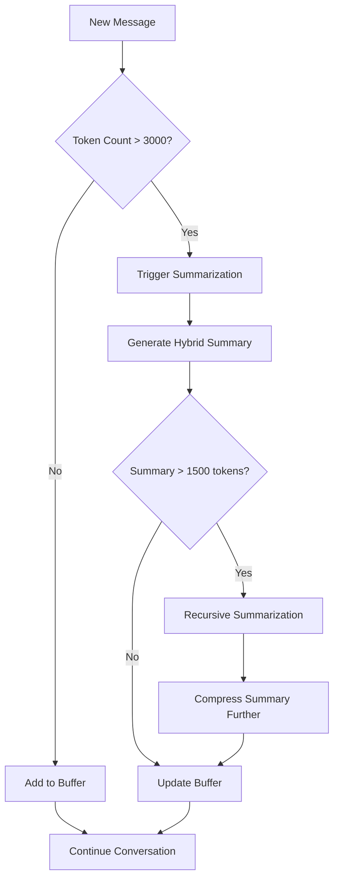

**Hybrid Progressive Summarization Logic:**

```javascript
async function progressiveSummary(conversationHistory) {
    return {
        // Human-readable conversation summary
        text_summary:
            'Customer seeking energy supplements, prefers natural solutions. Discussed B-complex vitamins and magnesium. Shows interest in capsule forms over powders. Budget-conscious but willing to invest in quality products.',

        // Simplified structured data for system use
        structured_data: {
            interests: ['energy supplements', 'natural wellness'],
            preferences: ['capsules', 'evidence-based'],
            budget: 'moderate',
            sentiment: 'positive',
        },
    };
}
```

**Recursive Summarization Example:**

```
Original Conversation: 4,500 tokens
├─ First Summary: 1,800 tokens (still too large)
├─ Recursive Summary: 800 tokens ✓
└─ Final Context: Text summary + structured data = 850 tokens
```

### Long-Term Memory: Vector-Based Retrieval with pgvector

Long-term memory uses [pgvector](https://github.com/pgvector/pgvector) for semantic storage and retrieval:

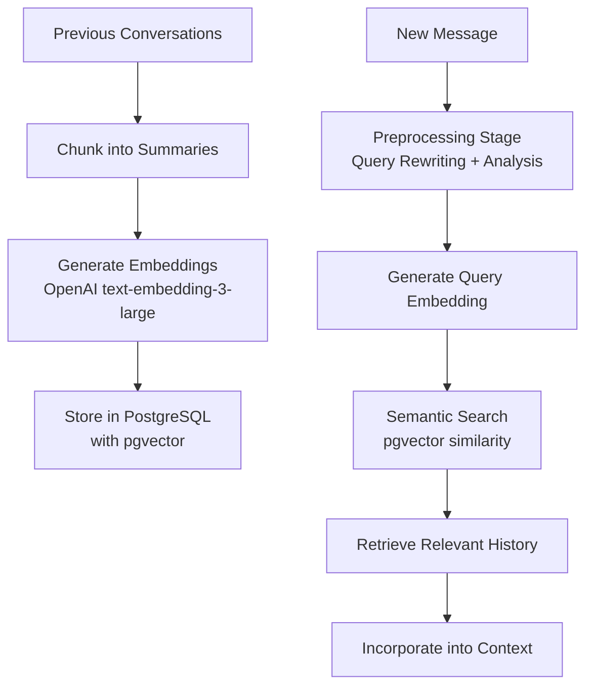

### Query Rewriting for Effective Retrieval

**Integration with Preprocessing Stage:**

Query rewriting is a critical component of the preprocessing stage, working alongside intent classification and context preparation. During preprocessing, the system simultaneously analyzes user intent AND rewrites the query for optimal memory retrieval.

**Why Query Rewriting is Critical:**

Raw user messages are often conversational, ambiguous, or lack the specific terminology needed for effective semantic search. Query rewriting transforms user input into optimized search queries that better retrieve relevant context.

**Key Benefits:**

-   **Contextual Clarity**: Incorporates conversation context to resolve pronouns and implicit references
-   **Semantic Optimization**: Replaces colloquial terms with precise terminology that matches stored content
-   **Intent Expansion**: Adds related concepts that might be relevant but not explicitly mentioned
-   **Search Effectiveness**: Significantly improves retrieval accuracy and relevance

**Streamlined Processing Approach:**

```javascript
const preprocessingPrompt = `
You are given information about a wellness chat between an AI wellness assistant and the customer.

You are given the following information:
Chat conversation history - enclosed in <CHAT></CHAT> tags
The new message from the customer - enclosed in <MESSAGE></MESSAGE> tags

Your main task is to revise the new customer message combining it with a brief summary of the conversation history. The revised message will be used to perform a similarity search in a vector database with wellness conversations and product information to be used as context.

"revisedMessage":
- Revise the customer's message and add relevant context from the conversation history
- Include wellness/supplement terminology where relevant
- Resolve any pronouns or implicit references
- Respond with empty string if new message is empty

Your secondary tasks are to generate lightweight metadata:

"conversationTitle": 2-3 word headline of the FULL conversation based on the ENTIRETY of the conversation including the new message
- Be specific – avoid vague titles like "Health Discussion"
- If there are multiple topics, pick the most important ones: "Energy, Sleep"
- Avoid filler words. Instead of "Discussion about vitamins" write "Vitamin consultation"
- Prioritise customer needs over AI responses
- Use simple, clear terminology

"intent": Single phrase describing customer's primary intent from these standard options:
- product_recommendation
- dosage_question
- product_upgrade_request
- wellness_advice
- product_comparison
- symptom_inquiry
- ingredient_question
- lifestyle_support
- follow_up
- general_greeting

"healthKeywords": Array of health-related terms relevant for search

Respond with JSON schema:
{
  "revisedMessage": "...", // revised customer message for vector search
  "conversationTitle": "...", // 2-3 word summary headline of entire conversation
  "intent": "...", // primary customer intent from standard list
  "healthKeywords": [...] // health-related search terms
}`;
```

**Preprocessing Input/Output Example:**

```
Input:
- Message: "Do you have anything stronger for that?"
- Chat History: "Customer mentioned trouble sleeping, discussed basic magnesium supplements"

Preprocessing Output:
{
    "revisedMessage": "high-potency magnesium sleep supplements stronger formulations insomnia sleep aid alternatives",
    "conversationTitle": "Sleep supplements",
    "intent": "product_upgrade_request",
    "healthKeywords": ["sleep", "insomnia", "supplements", "magnesium"]
}
```

**Speed Optimization Benefits:**

-   **Reduced Latency**: Lightweight processing enables faster memory retrieval
-   **Improved UX**: Quicker time-to-first-streaming-chunk
-   **Cost Efficiency**: Smaller prompts reduce API costs
-   **Scalability**: Faster preprocessing supports higher concurrent users
-   **Contextual Metadata**: Provides structured context for main processing without complex analysis

## 3. Three-Stage Processing Pipeline

### Processing Flow with Technology Stack


### Preprocessing Stage

**Primary Role:** Query rewriting for optimal vector search retrieval

**Secondary Role:** Conversation title generation and lightweight metadata

**Why Speed is Critical:**

Preprocessing speed directly impacts user experience through time-to-first-text-streaming-chunk. Users perceive response delays most acutely in the initial moments, making preprocessing optimization essential for a responsive chatbot experience. A fast, lightweight preprocessing stage enables quicker memory retrieval and faster streaming onset.

**Streamlined Processing Approach:**

```javascript
const preprocessingPrompt = `
You are given information about a wellness chat between an AI wellness assistant and the customer.

You are given the following information:
Chat conversation history - enclosed in <CHAT></CHAT> tags
The new message from the customer - enclosed in <MESSAGE></MESSAGE> tags

Your main task is to revise the new customer message combining it with a brief summary of the conversation history. The revised message will be used to perform a similarity search in a vector database with wellness conversations and product information to be used as context.

"revisedMessage":
- Revise the customer's message and add relevant context from the conversation history
- Include wellness/supplement terminology where relevant
- Resolve any pronouns or implicit references
- Respond with empty string if new message is empty

Your secondary tasks are to generate lightweight metadata:

"conversationTitle": 2-3 word headline of the FULL conversation based on the ENTIRETY of the conversation including the new message
- Be specific – avoid vague titles like "Health Discussion"
- If there are multiple topics, pick the most important ones: "Energy, Sleep"
- Avoid filler words. Instead of "Discussion about vitamins" write "Vitamin consultation"
- Prioritise customer needs over AI responses
- Use simple, clear terminology

"intent": Single phrase describing customer's primary intent from these standard options:
- product_recommendation
- dosage_question
- product_upgrade_request
- wellness_advice
- product_comparison
- symptom_inquiry
- ingredient_question
- lifestyle_support
- follow_up
- general_greeting

"healthKeywords": Array of health-related terms relevant for search

Respond with JSON schema:
{
  "revisedMessage": "...", // revised customer message for vector search
  "conversationTitle": "...", // 2-3 word summary headline of entire conversation
  "intent": "...", // primary customer intent from standard list
  "healthKeywords": [...] // health-related search terms
}`;
```

**Preprocessing Input/Output Example:**

```
Input:
- Message: "Do you have anything stronger for that?"
- Chat History: "Customer mentioned trouble sleeping, discussed basic magnesium supplements"

Preprocessing Output:
{
    "revisedMessage": "high-potency magnesium sleep supplements stronger formulations insomnia sleep aid alternatives",
    "conversationTitle": "Sleep supplements",
    "intent": "product_upgrade_request",
    "healthKeywords": ["sleep", "insomnia", "supplements", "magnesium"]
}
```

**Speed Optimization Benefits:**

-   **Reduced Latency**: Lightweight processing enables faster memory retrieval
-   **Improved UX**: Quicker time-to-first-streaming-chunk
-   **Cost Efficiency**: Smaller prompts reduce API costs
-   **Scalability**: Faster preprocessing supports higher concurrent users
-   **Contextual Metadata**: Provides structured context for main processing without complex analysis

### Main Processing Stage

**Role:** Generate primary response using retrieved context with proper persona, tone, and safety guardrails

**System Prompt Structure:**

```
SYSTEM_PROMPT = "
You are a knowledgeable and empathetic wellness assistant for Holland & Barrett, helping customers make informed decisions about natural health and wellness products.

Key Guidelines:
- Always prioritize customer safety and wellbeing
- Provide evidence-based information when discussing health topics
- Recommend products based on customer needs and preferences
- Include appropriate disclaimers for health-related advice
- Maintain a supportive, informative, and professional tone
- Never provide medical diagnoses or replace professional medical advice

Refer to yourself as a 'wellness assistant' and mention Holland & Barrett when relevant.
Always respond in a conversational, helpful manner with clear formatting using markdown.
"
```

**User Prompt Integration:**

```javascript
const USER_PROMPT_TEMPLATE = `
You are engaged in a wellness consultation with a customer.

Your task is to provide a helpful, informative response to the customer's message based on:
- Relevant conversation history - enclosed in <HISTORY> tags
- Product knowledge and recommendations - enclosed in <PRODUCTS> tags
- Customer preferences and past interactions - enclosed in <CUSTOMER> tags
- Wellness knowledge and information - enclosed in <KNOWLEDGE> tags
- The customer's new message - enclosed in <MESSAGE> tags
- The intent of the customer's message - enclosed in <INTENT> tags

Intent-Based Response Guidelines:

1. **product_recommendation**: Focus on suggesting specific products with clear benefits and comparisons
2. **dosage_question**: Provide general guidance while emphasizing individual needs vary and healthcare consultation
3. **product_upgrade_request**: Compare current product with higher-potency or alternative options
4. **wellness_advice**: Share evidence-based lifestyle and nutritional guidance with actionable tips
5. **product_comparison**: Create clear side-by-side comparison of benefits, ingredients, and use cases
6. **symptom_inquiry**: Acknowledge symptoms, suggest potential nutritional support, always recommend healthcare consultation
7. **ingredient_question**: Explain ingredient benefits, sources, and how it supports health goals
8. **lifestyle_support**: Provide holistic advice combining supplements with lifestyle changes
9. **follow_up**: Build on previous recommendations, assess progress, and suggest next steps
10. **general_greeting**: Warm welcome, understand customer needs, and guide conversation toward specific wellness goals

Response Format Guidelines:
- Start with empathetic acknowledgment of customer's situation
- Use clear markdown formatting with headers and bullet points
- Include health disclaimers when discussing symptoms or medical conditions
- End with engaging questions to continue the conversation
- Always prioritize customer safety and evidence-based recommendations
`;

async function mainProcessingStage(input) {
    const formattedPrompt = buildUserPrompt({
        customer_message: input.message,
        intent: input.preprocessing_output.intent,
        conversation_history: retrievedContext.short_term_memory,
        product_context: retrievedContext.product_knowledge,
        customer_profile: retrievedContext.long_term_memory,
        wellness_context: retrievedContext.wellness_knowledge,
    });

    const response = await aiModel.call({
        model: 'gpt-4.1',
        system_prompt: SYSTEM_PROMPT,
        user_prompt: formattedPrompt,
        temperature: 0.7,
        stream: true,
    });

    return response;
}
```

**Context Integration Example:**

```
Customer Message: "I'm still feeling tired after trying the B-complex. What else might help?"

Injected Context:
- History: "Customer purchased B-Complex vitamins 2 weeks ago, reported some improvement"
- Products: "Iron supplements, CoQ10, Rhodiola adaptogen, Magnesium for energy"
- Customer: "Prefers capsules, budget-conscious, works long hours"
- Knowledge: "Iron deficiency common cause of fatigue, adaptogens support energy naturally"
- Intent: "product_upgrade_request"
- Entities: ["fatigue", "B-complex", "energy", "supplements"]

Generated Response:
"I'm glad the B-complex has provided some improvement! Since you're still experiencing fatigue, let's explore a few other possibilities that work well alongside B vitamins.

**Iron Support**: Fatigue can often indicate low iron levels, especially if you follow a plant-based diet or have heavy periods. Our gentle Iron Bisglycinate is easy on the stomach and highly absorbable.

**Adaptogenic Support**: Rhodiola Rosea is excellent for sustained energy without the jitters. It helps your body adapt to stress and supports natural energy production.

**Cellular Energy**: CoQ10 supports energy production at the cellular level and works particularly well for people with demanding lifestyles.

*Please note: Persistent fatigue should be discussed with your healthcare provider to rule out any underlying conditions.*

Would you like to know more about any of these options, or would you prefer to book a consultation to discuss your energy goals in more detail?"
```

### Postprocessing Stage

**Role:** Transform AI response into structured JSON with interactive UI components, compliance elements, and personalized actions

**System Prompt Structure:**

```javascript
const POSTPROCESSING_SYSTEM_PROMPT = `
You are a wellness assistant post-processor for Holland & Barrett. Your role is to analyze AI responses and create structured JSON output with interactive UI components.

Key Guidelines:
- Extract actionable product recommendations from the response
- Generate relevant follow-up questions to continue the wellness conversation
- Add appropriate health disclaimers based on content
- Create interactive elements that enhance customer experience
- Ensure all product suggestions include clear calls-to-action

Always respond in valid JSON format following the specified schema.
Response language should match the customer's language.
`;
```

**User Prompt for Interactive Elements:**

```javascript
const POSTPROCESSING_USER_PROMPT = `
You are analyzing an AI wellness assistant's response to create interactive UI elements.

Given information:
- The customer's original message - enclosed in <CUSTOMER_MESSAGE> tags
- The AI's response - enclosed in <AI_RESPONSE> tags
- Customer intent from preprocessing - enclosed in <INTENT> tags
- Conversation context - enclosed in <CONTEXT> tags

Your task is to generate structured JSON with interactive elements:
- Extract product recommendations with pricing and CTAs
- Generate 3 relevant follow-up questions (5-7 words, customer perspective)
- Add health disclaimers and compliance statements
- Suggest wellness actions (articles, assessments, consultations)

Respond with structured JSON containing product_recommendations, follow_up_questions, disclaimers, and wellness_actions.
`;

async function postprocessingStage(aiResponse, context) {
    const response = await aiModel.call({
        model: 'gpt-4.1-mini',
        system_prompt: POSTPROCESSING_SYSTEM_PROMPT,
        user_prompt: POSTPROCESSING_USER_PROMPT,
        temperature: 0.3,
        response_format: 'structured_json_schema',
    });

    return response.interactive_elements;
}
```

**Example Postprocessing Flow:**

```
Customer Message: "I'm still feeling tired after trying the B-complex. What else might help?"

AI Response: "I'm glad the B-complex has provided some improvement! Since you're still experiencing fatigue, let's explore Iron Bisglycinate for potential low iron levels, or Rhodiola Rosea for natural energy support. CoQ10 also supports cellular energy production."

Postprocessing Analysis:
├─ Intent: "product_upgrade_request"
├─ Products Mentioned: ["Iron Bisglycinate", "Rhodiola Rosea", "CoQ10"]
├─ Health Topic: "fatigue" → Requires health disclaimer
└─ Follow-up Opportunities: Iron testing, energy assessment, lifestyle factors

Generated JSON Output:
{
  "product_recommendations": [
    {
      "name": "Iron Bisglycinate 20mg",
      "price": "£9.99",
      "key_benefit": "Gentle, highly absorbed iron for energy",
      "cta_text": "Add to Basket",
      "product_id": "iron-bisgly-20"
    },
    {
      "name": "Rhodiola Rosea Extract",
      "price": "£14.99",
      "key_benefit": "Adaptogen for natural energy & stress",
      "cta_text": "Learn More",
      "product_id": "rhodiola-extract"
    }
  ],
  "follow_up_questions": [
    {
      "question": "Should I get my iron levels tested?",
      "context": "Iron deficiency screening",
      "icon": "🩺"
    },
    {
      "question": "How long until I see energy improvements?",
      "context": "Timeline expectations",
      "icon": "⏰"
    },
    {
      "question": "Can I take these with B-complex?",
      "context": "Supplement combinations",
      "icon": "💊"
    }
  ],
  "disclaimers": [
    {
      "type": "health_advice",
      "text": "Persistent fatigue should be evaluated by a healthcare provider to rule out underlying conditions."
    }
  ],
  "wellness_actions": [
    {
      "title": "Energy Assessment Quiz",
      "description": "Discover potential causes of your fatigue",
      "action_type": "quiz",
      "cta_text": "Take 2-Minute Quiz"
    }
  ]
}
```

**UI Rendering Benefits:**

-   **Enhanced Engagement**: Interactive elements increase customer interaction
-   **Seamless Shopping**: Direct product recommendations with purchase options
-   **Continued Conversation**: Follow-up questions maintain dialogue flow
-   **Compliance Assurance**: Automated disclaimer inclusion for health topics
-   **Personalized Journey**: Tailored wellness actions based on customer needs

## 4. Guardrails System

[↑ Back to Top](#table-of-contents)

### Parallel Safety Pipeline

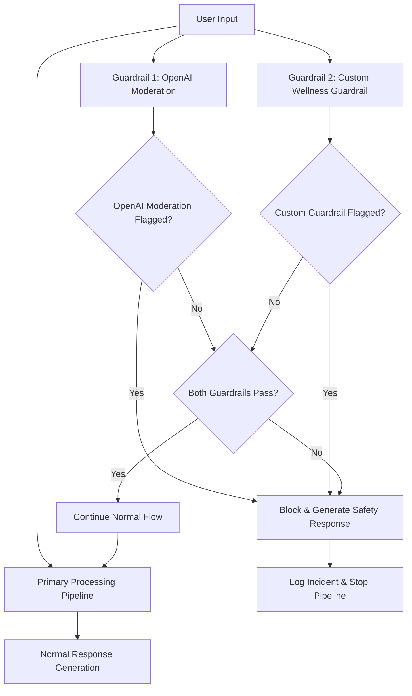

### Guardrail 1: OpenAI Moderation

**OpenAI Moderation Categories:**

```javascript
// OpenAI moderation endpoint response structure
const moderationResponse = {
    flagged: false,
    categories: {
        sexual: false,
        'sexual/minors': false,
        harassment: false,
        'harassment/threatening': false,
        hate: false,
        'hate/threatening': false,
        illicit: false,
        'illicit/violent': false,
        'self-harm': false,
        'self-harm/intent': false,
        'self-harm/instructions': false,
        violence: false,
        'violence/graphic': false,
    },
    category_scores: {
        sexual: 0.0001,
        'sexual/minors': 0.0001,
        harassment: 0.0002,
        // ... scores for each category
    },
};

async function openAIModerationCheck(userInput) {
    const response = await openai.moderations.create({
        input: userInput,
    });

    return {
        flagged: response.results[0].flagged,
        categories: response.results[0].categories,
        category_scores: response.results[0].category_scores,
    };
}
```

### Guardrail 2: Custom Wellness Guardrail

**Custom Wellness Safety Prompt:**

```javascript
const WELLNESS_GUARDRAIL_PROMPT = `
You are a safety guardrail for a Holland & Barrett wellness chatbot. Your job is to identify potentially harmful or inappropriate content specifically related to wellness and health advice.

Analyze the following customer message and determine if it violates any wellness safety guidelines:

STRICT VIOLATIONS (Block immediately):
- Requests for medical diagnoses or treatment of specific conditions
- Questions about prescription medications or drug interactions
- Requests for dosage advice that could be dangerous (especially for children, pregnancy, medical conditions)
- Attempts to use supplements to treat serious medical conditions instead of seeking medical care
- Requests for advice on eating disorders or extreme dieting
- Questions about using supplements to circumvent medical treatment

MODERATE CONCERNS (Flag for review):
- Vague health complaints that might indicate serious underlying conditions
- Questions about supplement interactions with medications
- Pregnancy-related supplement questions without proper disclaimers
- Requests for advice on children's supplements without age specification

ACCEPTABLE CONTENT:
- General wellness information requests
- Product availability and ingredient questions
- General lifestyle and nutrition advice
- Supplement education and benefits
- Routine wellness support questions

Customer Message: "{user_input}"

Respond with JSON only:
{
    "violation_detected": true/false,
    "severity": "strict" | "moderate" | "none",
    "category": "medical_diagnosis" | "prescription_advice" | "dangerous_dosage" | "medical_treatment_replacement" | "eating_disorder" | "child_safety" | "pregnancy_safety" | "medication_interaction" | "none",
    "reason": "Brief explanation if violation detected",
    "suggested_response": "Safe alternative response to guide customer to appropriate resources"
}
`;

async function customWellnessGuardrail(userInput) {
    const response = await aiModel.call({
        model: 'gpt-4.1-mini',
        prompt: WELLNESS_GUARDRAIL_PROMPT.replace('{user_input}', userInput),
        temperature: 0.1,
        response_format: 'json',
    });

    return JSON.parse(response.content);
}
```

### Parallel Guardrail Implementation

```javascript
async function runParallelGuardrails(userInput) {
    // Run both guardrails in parallel
    const [openAIResult, customResult] = await Promise.all([
        openAIModerationCheck(userInput),
        customWellnessGuardrail(userInput),
    ]);

    // Check if either guardrail flagged the content
    const isBlocked = openAIResult.flagged || (customResult.violation_detected && customResult.severity === 'strict');

    const needsReview = customResult.violation_detected && customResult.severity === 'moderate';

    if (isBlocked) {
        return {
            status: 'blocked',
            reason: openAIResult.flagged ? 'OpenAI moderation violation' : customResult.reason,
            suggested_response: customResult.suggested_response || generateGenericSafetyResponse(),
            openai_categories: openAIResult.categories,
            custom_category: customResult.category,
        };
    }

    if (needsReview) {
        // Log for human review but allow processing to continue with disclaimers
        logForReview({
            input: userInput,
            guardrail_result: customResult,
            timestamp: getCurrentTimestamp(),
        });

        return {
            status: 'approved_with_disclaimer',
            disclaimer_required: true,
            disclaimer_type: customResult.category,
        };
    }

    return {
        status: 'approved',
        openai_result: openAIResult,
        custom_result: customResult,
    };
}
```

### Safety Response Generation

```javascript
async function handleGuardrailViolation(guardrailResult) {
    const safetyResponses = {
        medical_diagnosis:
            "I can't provide medical diagnoses. For health concerns, please consult with a healthcare professional. I'm here to help with general wellness information and product guidance.",

        prescription_advice:
            'I cannot provide advice about prescription medications. Please speak with your doctor or pharmacist about any medication-related questions.',

        dangerous_dosage:
            'For safety reasons, I cannot recommend specific dosages, especially for children or during pregnancy. Please consult with a healthcare provider for personalized advice.',

        child_safety:
            "Children's wellness needs require special consideration. Please consult with a pediatrician before giving any supplements to children.",

        pregnancy_safety:
            "During pregnancy, it's essential to consult with your healthcare provider before starting any new supplements. I can share general information about pregnancy nutrition.",

        default:
            'I want to ensure I provide safe and appropriate guidance. For this type of question, I recommend speaking with a healthcare professional. Is there something else about general wellness I can help you with?',
    };

    const response =
        safetyResponses[guardrailResult.custom_category] ||
        guardrailResult.suggested_response ||
        safetyResponses.default;

    // Log the incident
    await logSafetyIncident({
        user_input: guardrailResult.input,
        violation_type: guardrailResult.custom_category,
        openai_categories: guardrailResult.openai_categories,
        timestamp: getCurrentTimestamp(),
        response_given: response,
    });

    return {
        type: 'safety_response',
        content: response,
        blocked: true,
    };
}
```

### Integration with Main Pipeline

```javascript
async function processCustomerMessage(userInput) {
    // Step 1: Run parallel guardrails
    const guardrailResult = await runParallelGuardrails(userInput);

    // Step 2: Handle based on guardrail results
    if (guardrailResult.status === 'blocked') {
        return await handleGuardrailViolation(guardrailResult);
    }

    if (guardrailResult.status === 'approved_with_disclaimer') {
        // Continue processing but ensure disclaimers are included
        const result = await mainProcessingPipeline(userInput, {
            require_disclaimer: true,
            disclaimer_type: guardrailResult.disclaimer_type,
        });
        return result;
    }

    if (guardrailResult.status === 'approved') {
        // Safe to proceed with normal processing
        return await mainProcessingPipeline(userInput);
    }

    // Default fallback to safety response
    return await handleGuardrailViolation(guardrailResult);
}
```

**Key Benefits of Dual Guardrail System:**

-   **Comprehensive Coverage**: OpenAI moderation handles broad safety categories while custom guardrail addresses wellness-specific risks
-   **Parallel Processing**: Both guardrails run simultaneously for minimal latency impact
-   **Graduated Response**: Moderate concerns allow processing with disclaimers rather than complete blocking
-   **Fail-Safe Design**: System defaults to blocking if guardrails are unavailable
-   **Audit Trail**: All safety decisions are logged for compliance and improvement

## 5. RAG Implementation with Wellness Knowledge

[↑ Back to Top](#table-of-contents)

### Understanding RAG: Two-Stage Process

RAG (Retrieval-Augmented Generation) enhances AI responses by incorporating relevant external knowledge. The system operates in two distinct phases that work together to provide contextually relevant information:

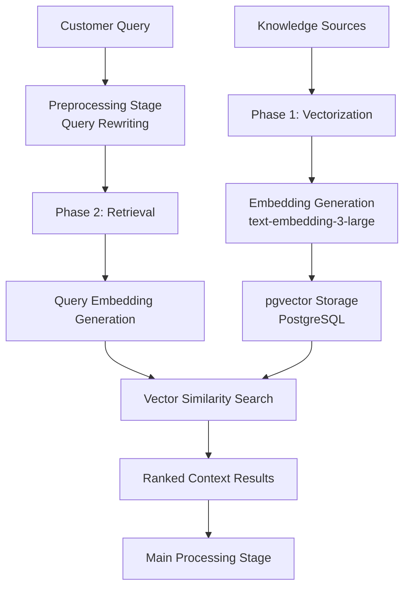

**Connection to Processing Pipeline:**

-   **Preprocessing Stage**: Query rewriting optimizes retrieval effectiveness (covered in Section 2)
-   **Memory Management**: Long-term memory uses same vector storage for customer history
-   **Main Processing**: Retrieved context feeds directly into GPT-4.1 for response generation

### Phase 1: Vectorization (Knowledge Ingestion)

**Purpose**: Transform all knowledge sources into searchable vector representations

**Process Overview:**

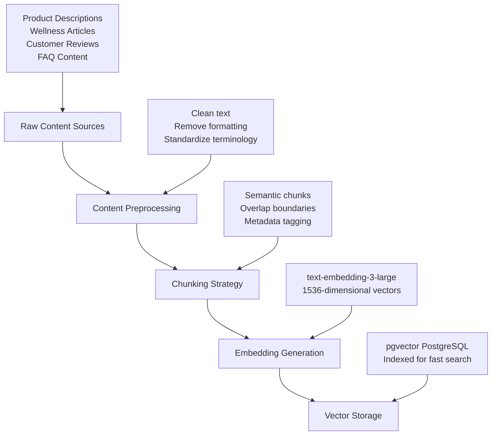

**Vectorization Example:**

```
Raw Product Description:
"Our Magnesium Glycinate 200mg capsules provide highly bioavailable magnesium in chelated form. Supports muscle relaxation, sleep quality, and stress management. Gentle on stomach, suitable for sensitive individuals. Take 1-2 capsules before bedtime."

Preprocessing:
├─ Clean formatting and standardize terminology
├─ Extract key concepts: magnesium glycinate, bioavailable, muscle relaxation, sleep, stress
└─ Add metadata: product_type="supplement", category="minerals", benefits=["sleep", "stress", "muscle"]

Embedding Generation:
text-embedding-3-large → [0.1234, -0.5678, 0.9012, ...] (1536 dimensions)

Storage Structure:
{
  "id": "prod_mag_glycinate_200",
  "content": "processed description text",
  "embedding": [1536-dimensional vector],
  "metadata": {
    "content_type": "product",
    "category": "minerals",
    "benefits": ["sleep", "stress", "muscle"],
    "price_range": "mid"
  }
}
```

**Knowledge Source Processing:**

```javascript
async function vectorizeContentBatch(contentBatch) {
    const processedChunks = [];

    for (const chunk of contentBatch) {
        const processedChunk = {
            id: generateId(chunk),
            content: preprocessText(chunk.raw_content),
            metadata: extractMetadata(chunk),
            source_type: chunk.type, // 'product', 'article', 'faq', 'review'
        };
        processedChunks.push(processedChunk);
    }

    // Generate embeddings in batches for efficiency
    const embeddings = await embeddingApi.call({
        model: 'text-embedding-3-large',
        input: processedChunks.map((chunk) => chunk.content),
        dimensions: 1536,
    });

    // Store in pgvector database
    for (let i = 0; i < processedChunks.length; i++) {
        await database.insert({
            table: 'knowledge_base',
            data: {
                id: processedChunks[i].id,
                content: processedChunks[i].content,
                embedding: embeddings[i],
                metadata: processedChunks[i].metadata,
                source_type: processedChunks[i].source_type,
            },
        });
    }

    return processedChunks.map((chunk, i) => ({
        ...chunk,
        embedding: embeddings[i],
    }));
}
```

### Phase 2: Retrieval (Query-Time Search)

**Purpose**: Find most relevant knowledge for the current customer query

**Retrieval Integration with Preprocessing:**

The retrieval phase directly leverages the query rewriting performed in the preprocessing stage (Section 2). The rewritten query is specifically optimized for effective vector search:

```
Original Query: "Do you have anything stronger for that?"
Preprocessing Output: "high-potency magnesium sleep supplements stronger formulations insomnia sleep aid alternatives"

This rewritten query significantly improves vector search effectiveness by:
├─ Adding specific terminology that matches stored content
├─ Expanding context from conversation history
├─ Including related concepts for broader matching
└─ Using language that aligns with product descriptions
```

**Vector Search Implementation:**

```javascript
async function performVectorSearch(rewrittenQuery, filters) {
    // Generate embedding for the rewritten query
    const queryEmbedding = await embeddingApi.call({
        model: 'text-embedding-3-large',
        input: rewrittenQuery,
        dimensions: 1536,
    });

    // Vector similarity search using vectorSearch pattern
    const searchParameters = {
        table: 'knowledge_base',
        embedding_column: 'embedding',
        operator: 'dot', // dot product operator
        query: queryEmbedding.vector,
        threshold: -0.5, // threshold rule of thumb for dot product
        limit: filters.limit || 10,
        where: buildFilters(filters), // additional filtering conditions
    };

    const results = await database.vectorSearch(searchParameters);
    return results;
}

// Helper function to build additional filter conditions
function buildFilters(filters) {
    const conditions = [];

    if (filters.content_type) {
        conditions.push('source_type filter');
    }

    if (filters.category) {
        conditions.push('metadata category filter');
    }

    if (conditions.length > 0) {
        return conditions.join(' AND ');
    } else {
        return null;
    }
}
```

**Complete Retrieval Flow Example:**

```
Step 1: Query Analysis (from Preprocessing)
├─ Original: "I'm still tired after the B-complex"
├─ Rewritten: "fatigue energy supplements B-complex alternatives iron magnesium CoQ10 tiredness"
└─ Intent: "product_upgrade_request"

Step 2: Vector Search Execution
├─ Query embedding: [0.2341, -0.1567, 0.8923, ...] (1536 dims)
├─ Search filters: content_type=['product', 'article'], category=['energy', 'vitamins']
└─ Similarity threshold: 0.5

Step 3: Retrieved Results (Top 3)
┌─ Result 1 (similarity: 0.87)
│  ├─ Content: "Iron Bisglycinate 20mg - gentle iron for fatigue and energy support"
│  ├─ Source: product
│  └─ Metadata: {category: "minerals", benefits: ["energy", "fatigue"]}
├─ Result 2 (similarity: 0.82)
│  ├─ Content: "Understanding B-Complex limitations and complementary nutrients"
│  ├─ Source: article
│  └─ Metadata: {category: "education", topic: "vitamin_combinations"}
└─ Result 3 (similarity: 0.78)
   ├─ Content: "CoQ10 Ubiquinol - cellular energy production support"
   ├─ Source: product
   └─ Metadata: {category: "antioxidants", benefits: ["cellular_energy"]}

Step 4: Context Assembly for Main Processing
Formatted context combining:
├─ Product recommendations with specific benefits
├─ Educational content explaining nutrient interactions
├─ Related products for comprehensive solutions
└─ Customer-specific filtering based on preferences
```

### Hybrid Search Strategy

**Combining Multiple Retrieval Methods:**

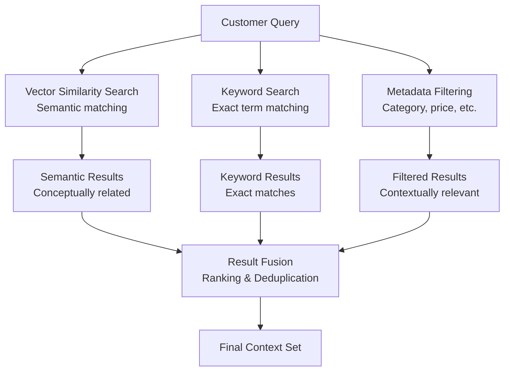

**Advanced Retrieval Techniques:**

```javascript
async function hybridSearch(query, customerProfile, conversationHistory) {
    // Stage 1: Core semantic search
    const semanticResults = await performVectorSearch(query.rewritten, {
        content_type: ['product', 'article'],
        limit: 8,
    });

    // Stage 2: Customer history search (long-term memory)
    const historyResults = await performVectorSearch(query.rewritten, {
        content_type: ['customer_history'],
        customer_id: customerProfile.id,
        limit: 3,
    });

    // Stage 3: Exact keyword matching for specific products
    const keywordResults = await keywordSearch(query.entities, {
        boost_exact_matches: true,
        limit: 3,
    });

    // Stage 4: Fusion and ranking
    const finalResults = await fuseResults({
        result_sets: [semanticResults, historyResults, keywordResults],
        weights: {
            semantic_weight: 0.6,
            history_weight: 0.3,
            keyword_weight: 0.1,
        },
        diversity_threshold: 0.8, // avoid too similar results
    });

    return finalResults;
}
```

**Context Quality Optimization:**

```
Retrieval Quality Factors:
├─ Semantic Relevance: Vector similarity scores > 0.5
├─ Diversity: Avoid multiple similar results
├─ Recency: Prefer up-to-date product information
├─ Customer Alignment: Match preferences and history
└─ Content Balance: Mix products, education, and reviews

Context Assembly Rules:
├─ Maximum 800 tokens for product context
├─ Maximum 400 tokens for educational content
├─ Maximum 300 tokens for customer history
└─ Reserve space for conversation summary
```

### RAG Performance Optimization

**Vector Search Efficiency:**

```sql
-- pgvector index optimization for fast retrieval
CREATE INDEX ON knowledge_base USING ivfflat (embedding vector_cosine_ops)
WITH (lists = 1000);

-- Metadata indexes for filtered searches
CREATE INDEX idx_knowledge_content_type ON knowledge_base(source_type);
CREATE INDEX idx_knowledge_category ON knowledge_base USING GIN((metadata->>'category'));
```

This comprehensive RAG implementation provides the foundation for contextually relevant, accurate responses by effectively connecting customer queries to the most appropriate wellness knowledge and product information through sophisticated vectorization and retrieval processes.

## 6. Streaming Response Architecture

[↑ Back to Top](#table-of-contents)

### Real-Time Communication Flow

**Client Types**: Customer-facing applications (websites, mobile apps) or internal systems (contact centre systems, CRM platforms)

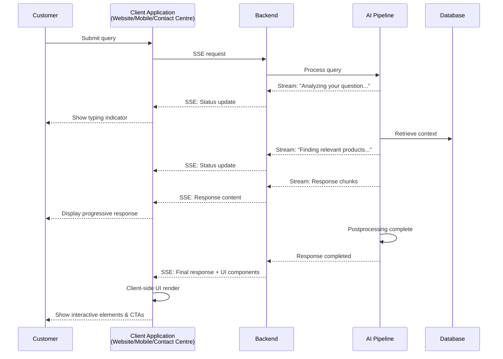

**Streaming Implementation:**

```javascript
// Progressive response delivery with final UI render
async function streamingResponse(customerQuery) {
    // Send status update
    sendStreamEvent({
        type: 'status',
        content: 'Understanding your wellness goals...',
    });

    // Send response chunks as they're generated
    sendStreamEvent({
        type: 'response_chunk',
        content: "Based on your interest in natural energy support, I'd recommend...",
    });

    // Send completion with UI components
    sendStreamEvent({
        type: 'response_completed',
        content: {
            final_text: 'Complete response...',
            ui_components: {
                products: [
                    /* ... */
                ],
                follow_ups: [
                    /* ... */
                ],
            },
        },
    });

    // Client-side UI renders interactive elements
    triggerClientUIRender();
}
```

## 7. Multi-Modal Capabilities

[↑ Back to Top](#table-of-contents)

### Technology Integration

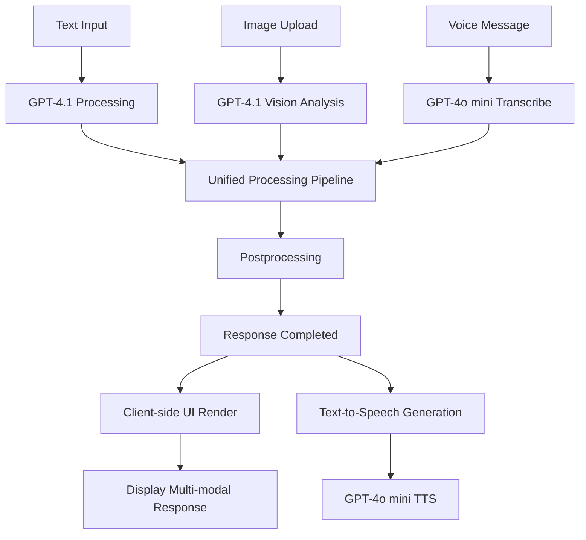

**Multi-Modal Example Flow:**

```
Input: Voice message "What's this supplement good for?" + Product image

Processing:
├─ GPT-4o mini Transcribe: Transcribe voice to text
├─ GPT-4.1 Vision: Analyze product image → "Omega-3 Fish Oil 1000mg"
└─ Combined query: "What's Omega-3 Fish Oil 1000mg good for?"

Processing Pipeline:
├─ Unified processing pipeline
├─ Postprocessing completed
├─ Response completed
└─ Client-side UI render

Response Options (Client-rendered):
├─ Text: Detailed omega-3 benefits
├─ Voice: GPT-4o mini TTS for hands-free interaction
└─ Visual: Interactive product information
```

### Multimodal Interactions

```javascript
// Combined audio/text response processing
async function multimodalResponse(input) {
    const aiResponse = await aiModel.call({
        template_id: 'multimodal/response',
        variables: promptVariables,
        modalities: ['text', 'audio'],
        audio_stream: passThroughStream,
        voice: 'guide.voice_hd',
    });

    return aiResponse;
}
```

## 8. Conversation Examples

[↑ Back to Top](#table-of-contents)

### Complete Interaction Flow

```
Customer: "I'm pregnant and wondering about safe vitamins"

┌─ STAGE 1: Content Moderation ✓
│  └─ omni-moderation-latest: Pregnancy topic flagged for extra care
├─ STAGE 2: Preprocessing (GPT-4.1 mini)
│  ├─ Query Rewriting: "pregnancy vitamins safe prenatal supplements nutrition expecting mothers"
│  ├─ Intent Classification: "pregnancy_wellness"
│  ├─ Entities: ["pregnancy", "vitamins", "safety", "prenatal"]
│  └─ Requires Disclaimer: true
├─ STAGE 3: Memory Retrieval & RAG
│  ├─ Short-term Memory: No previous pregnancy discussions
│  ├─ Long-term Memory: Customer wellness journey (pgvector search)
│  └─ RAG Context: Pregnancy-safe supplements, regulatory guidelines
├─ STAGE 4: Main Processing (GPT-4.1)
│  └─ System Prompt: Wellness assistant with pregnancy safety protocols
└─ STAGE 5: Postprocessing (GPT-4.1 mini)
   └─ Generate interactive UI components

Main Processing Response:
"Congratulations on your pregnancy! It's wonderful that you're thinking about nutritional support. During pregnancy, it's essential to focus on prenatal vitamins specifically formulated for expecting mothers..."

Postprocessing Output (JSON):
{
  "product_recommendations": [
    {
      "name": "Pregnancy Multivitamin with Folic Acid",
      "price": "£18.99",
      "key_benefit": "Essential nutrients for pregnancy",
      "cta_text": "View Details",
      "product_id": "pregnancy-multi-folic"
    },
    {
      "name": "Pregnancy Omega-3 DHA",
      "price": "£24.99",
      "key_benefit": "Brain development support",
      "cta_text": "Learn More",
      "product_id": "pregnancy-omega3-dha"
    }
  ],
  "follow_up_questions": [
    {
      "question": "What nutrients are most important now?",
      "context": "Pregnancy nutrition priorities",
      "icon": "🤱"
    },
    {
      "question": "Are there foods I should avoid?",
      "context": "Pregnancy dietary restrictions",
      "icon": "🚫"
    },
    {
      "question": "When should I start taking prenatal vitamins?",
      "context": "Supplement timing guidance",
      "icon": "⏰"
    }
  ],
  "disclaimers": [
    {
      "type": "health_advice",
      "text": "Always consult your healthcare provider before starting any new supplements during pregnancy."
    },
    {
      "type": "general",
      "text": "This advice is for educational purposes only and is not intended to replace professional medical advice."
    }
  ],
  "wellness_actions": [
    {
      "title": "Pregnancy Nutrition Guide",
      "description": "Download our comprehensive guide to eating well during pregnancy",
      "action_type": "article",
      "cta_text": "Download Guide"
    },
    {
      "title": "Prenatal Consultation",
      "description": "Book a free 15-minute consultation with our pregnancy nutrition specialist",
      "action_type": "consultation",
      "cta_text": "Book Consultation"
    }
  ]
}

→ STAGE 6: Response Completed
→ STAGE 7: Client-side UI Render
→ Interactive pregnancy wellness interface with products, questions, and resources
```

### Progressive Memory Evolution Example

**Customer Journey: "Sarah's Wellness Journey"**

```
Session 1 (Week 1) - Conversation 1: "Energy concerns"
├─ Message: "I need help with low energy"
├─ Preprocessing: intent="wellness_advice", entities=["energy", "fatigue"]
├─ Memory Created: {
│    "health_goals": ["energy_boost"],
│    "preferences": ["natural_solutions"],
│    "context": "Works long hours, drinks coffee",
│    "conversation_title": "Energy support"
│  }
└─ Products Recommended: B-Complex vitamins

Session 2 (Week 3) - Conversation 2: "Sleep optimization"
├─ Message: "The B-vitamins helped! What about sleep?"
├─ Preprocessing: intent="follow_up", entities=["B-vitamins", "sleep"]
├─ Memory Retrieved: Previous energy discussion (via pgvector)
├─ Memory Updated: {
│    "health_goals": ["energy_boost", "sleep_improvement"],
│    "successful_products": ["B-Complex"],
│    "satisfaction": "positive_with_B_vitamins",
│    "new_concerns": ["sleep_quality"],
│    "conversation_title": "Energy, Sleep"
│  }
└─ Products Recommended: Magnesium Glycinate, Chamomile

Session 3 (Month 2) - Conversation 3: "Fitness support"
├─ Message: "Starting a new exercise routine, any recovery supplements?"
├─ Preprocessing: intent="lifestyle_support", entities=["exercise", "recovery", "supplements"]
├─ Memory Retrieved: Energy + sleep journey context
├─ Enhanced Memory: {
│    "health_journey": "energy → sleep → fitness",
│    "trusted_categories": ["vitamins", "minerals"],
│    "lifestyle_changes": ["increased_exercise"],
│    "communication_style": "detailed_explanations_preferred",
│    "customer_segment": "wellness_conscious_active"
│  }
└─ Products Recommended: Protein powder, CoQ10, Omega-3
```

### Multi-Stage Processing Example

**Customer Input: "Do you have anything stronger for that?" (Following sleep discussion)**

```
STAGE 1: Content Moderation
├─ Input: "Do you have anything stronger for that?"
├─ omni-moderation-latest: Content approved ✓
└─ Continue to preprocessing

STAGE 2: Preprocessing (GPT-4.1 mini)
├─ Input Context: Previous discussion about basic magnesium for sleep
├─ Query Rewriting: "high-potency magnesium sleep supplements stronger formulations insomnia sleep aid alternatives"
├─ Intent: "product_upgrade_request"
├─ Entities: ["magnesium", "sleep", "insomnia", "supplements"]
├─ Conversation Title: "Sleep supplements"
└─ Requires Disclaimer: false

STAGE 3: Memory Retrieval & RAG
├─ Short-term Memory: Progressive summary of sleep discussion
├─ Long-term Memory: Customer's wellness journey and preferences
├─ Vector Search Results:
│  ├─ "Magnesium Glycinate High Potency 400mg" (similarity: 0.89)
│  ├─ "Sleep Complex with Valerian & Passionflower" (similarity: 0.84)
│  └─ "Melatonin 3mg Slow Release" (similarity: 0.81)
└─ Context Assembly: 850 tokens total

STAGE 4: Main Processing (GPT-4.1)
├─ System Prompt: Wellness assistant persona with safety guidelines
├─ User Prompt: Structured context injection with XML tags
├─ Intent-based Logic: "product_upgrade_request" response pattern
└─ Response: Detailed comparison of higher-potency sleep supplements

STAGE 5: Postprocessing (GPT-4.1 mini)
├─ Extract Products: Magnesium Glycinate 400mg, Sleep Complex
├─ Generate Follow-ups: Dosage timing, combination safety, timeline
├─ Add Disclaimers: Sleep disorder medical consultation
└─ Wellness Actions: Sleep hygiene assessment

STAGE 6: Response Completed
└─ Streaming complete, ready for UI render

STAGE 7: Client-side UI Render
├─ Display progressive text response
├─ Render product recommendation cards
├─ Show follow-up question buttons
├─ Display disclaimer banner
└─ Present wellness action CTAs
```

### Streaming & UI Integration Example

**Real-time Response Flow:**

```
Customer submits query → SSE request initiated

STREAM EVENT 1:
type: "status"
content: "Understanding your sleep concerns..."

STREAM EVENT 2:
type: "response_chunk"
content: "Based on your experience with basic magnesium, let's explore some higher-potency options that might be more effective for your sleep needs..."

STREAM EVENT 3:
type: "response_chunk"
content: "**High-Potency Magnesium Glycinate 400mg** provides double the strength while remaining gentle on your stomach..."

STREAM EVENT 4:
type: "response_completed"
content: {
  final_text: "Complete response text...",
  ui_components: {
    // Postprocessing JSON structure from Stage 5
    product_recommendations: [...],
    follow_up_questions: [...],
    disclaimers: [...],
    wellness_actions: [...]
  }
}

→ Client Application (Website/Mobile/Contact Centre) renders:
├─ Complete text response with markdown formatting
├─ Interactive product cards with "Add to Basket" buttons
├─ Follow-up question buttons (5-7 words each)
├─ Health disclaimer banner
└─ Wellness action buttons (quiz, consultation, article)
```

This comprehensive example demonstrates the full architecture in action: from content moderation through progressive memory management, multi-stage AI processing, structured postprocessing output, streaming delivery, and finally client-side UI rendering of interactive wellness experiences.

## 9. Client-Side Processing & Rendering

[↑ Back to Top](#table-of-contents)

### Stream Processing Overview

The client application receives streaming responses from the AI pipeline and progressively renders content as it arrives. This creates a smooth, responsive user experience where customers see immediate feedback and rich interactive elements.

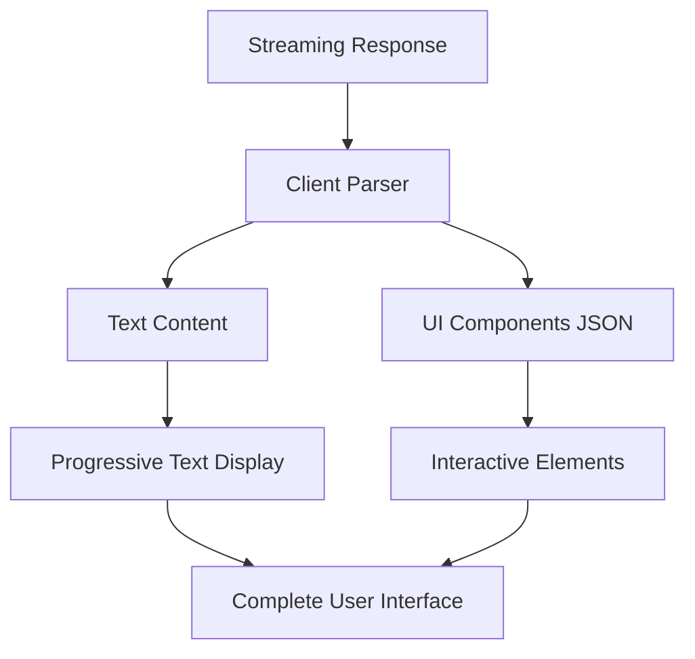

### Progressive Content Rendering

**Three-Stage Client Processing:**

1. **Status Updates**: Show processing indicators ("Understanding your question...", "Finding products...")
2. **Text Streaming**: Display AI response text progressively as it's generated
3. **Interactive Components**: Render buttons, product cards, and follow-up options after completion

**Key Client-Side Challenges:**

-   **Partial JSON Handling**: Postprocessing responses arrive as streaming JSON that may be incomplete
-   _Recommended solution_: Use `partial-json` library (compatible with React Native and Node.js)
-   _Performance benefit_: 4x to 10x faster than alternative parsers like `best-effort-json-parser`
-   **Content Reconstruction**: Text chunks must be assembled in correct order
-   **Graceful Degradation**: System continues working even if JSON parsing fails

### Simple Implementation Approach

```javascript
// Basic client-side flow
function handleStreamEvent(event) {
    switch (event.type) {
        case 'status':
            showStatusMessage(event.content);
            break;
        case 'response_chunk':
            appendTextContent(event.content);
            break;
        case 'response_completed':
            parseAndRenderComponents(event.ui_components);
            break;
    }
}
```

### Client Platform Flexibility

**Multi-Platform Support**: The streaming architecture works across different client types:

-   **Web Applications**: Browser-based SSE with progressive rendering
-   **Mobile Apps**: Native streaming with optimized UI components
-   **Contact Centre Systems**: Agent-facing interfaces with real-time responses

**User Experience Benefits:**

-   **Immediate Feedback**: Users see responses start within milliseconds
-   **Rich Interactions**: Product recommendations, follow-up questions, and wellness actions
-   **Resilient Performance**: Continues working even with network issues or parsing errors
-   **Platform Consistency**: Same logical flow across web, mobile, and contact centre interfaces

This client-side architecture ensures the sophisticated AI pipeline delivers responsive, interactive experiences while maintaining simplicity and reliability across all platform types.

## Technology Stack Summary

[↑ Back to Top](#table-of-contents)

### Core AI Technologies

-   **Language Model**: OpenAI GPT-4.1 (main processing and vision), GPT-4.1 mini (preprocessing/postprocessing/summarization)
-   **Embeddings**: OpenAI text-embedding-3-large
-   **Moderation**: omni-moderation-latest
-   **Audio**: GPT-4o mini Transcribe (speech-to-text), GPT-4o mini TTS (text-to-speech)

### Infrastructure

-   **Vector Database**: PostgreSQL with pgvector extension
-   **Streaming**: Server-Sent Events with WebSocket fallback
-   **API Gateway**: Rate limiting and request routing

This architecture provides a robust foundation for sophisticated wellness chatbots that can handle complex customer needs while maintaining safety, personalization, and regulatory compliance through intelligent memory management and multi-stage processing.

---

## Document Attribution

This document was created by **Dobo Radichkov** (Chief Data Officer at Holland & Barrett and Founder of Onsen) together with **Claude-4-Sonnet** (in Cursor IDE) based on the Onsen AI companion backend architecture.

The architectural patterns and best practices documented here are derived from real-world implementation experience in building advanced AI chatbot systems for customer-facing wellness use cases.
